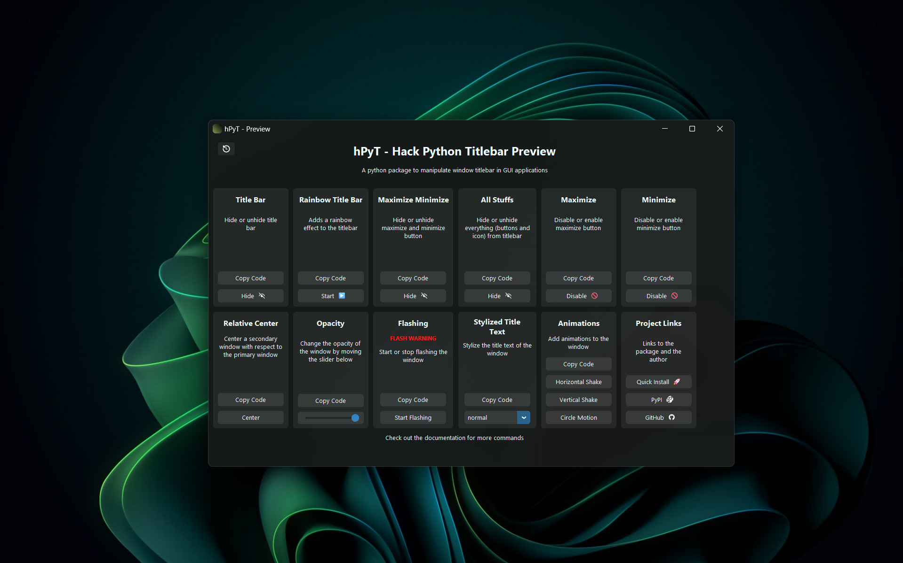
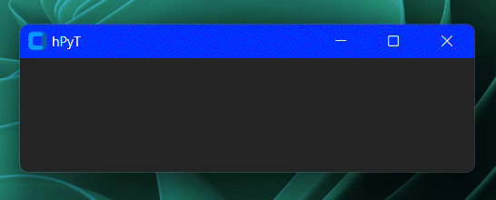
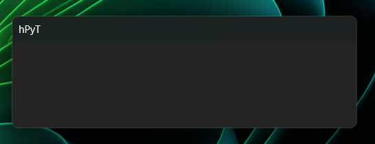
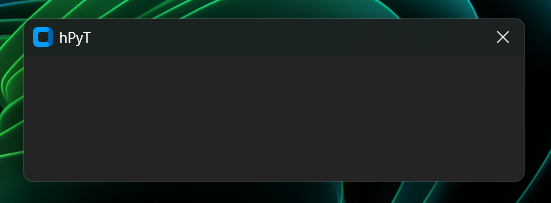

# MilanLet`sCode -- Custom Titlebar Hack
Code, source

<details>
<summary>🧾 Table of Content</summary>
<br>

- [📚 Supported Libraries](#📚-supported-libraries)
- [📦 Installing](#📦-installing)
- [🌈 Rainbow TitleBar](#🌈-rainbow-titlebar)
- [🔛 /Hide or Unhide titlebar](#🔛-hide-or-unhide-titlebar)
- [Hide Maximizes and minimizes](#hide-maximizes-and-minimizes)
</details>

---

## Let´s Code 😁

<br>

## 📚 Supported Libraries

- PySide
- PyQt5
- Tkinter - Custom Tkinter

<br>


## 📦 Installing

Install the libary [hPyT](https://pypi.org/project/hPyT/). Require tkinter or customtkinter

``` powershell
pip install hPyT==1.2.1
```

The Window Hack, require Windows 11

### Setup

``` python
'''
------------- Libaries -------------
'''
from customtkinter import *
from hPyT import *

'''
------------------------------------
                            |
       Setup or Code        V

------------------------------------
'''

example = CTk()

# ------ <- Code

example.mainloop()
```


## 🌈 Rainbow TitleBar

Add a rainbow titlebar:

``` python
from customtkinter import *
from hPyT import *

def example():# ---- Functions/def, !dont copy
    ...


example = CTk()

rainbow_titlebar_bar.start(example, interval=value/int)

example.mainloop() # <- code or objective
```

<h3>Window Example </h3>



`Its look` *so good * : ) <br>
*`interval` is the time in milliseconds in which the color would change*

<h4>

 _OK_  Nice

 </h4>

<style>

body {
    font-size: 26px;
    font-family: "Gill Sans Extrabold", sans-serif;
}


 </style>

 <br>

 ## 🔻Delet all Titlebar stuff

Hide all Titlebar stuff:

``` python
# Hide all titlebar stuff
all_stuffs.hide(example) # <- example = window or CTk 
```



 <h5> Or <span>🔻 </span> 

### 🔛 /Hide or Unhide titlebar

Hide the Titlebar

``` python

# Hide the titlebar, sorry no have image for this :(
title_bar.hide(example) # <- example = window or CTk 
```
<br>

## Hide Maximizes and minimizes

Hide the titlebar icons ( -  ▢ )

```python
maximize_minimize_button.hide(example)  # <- example = window or CTk 
# hides both maximize and minimize button
# maximize_minimize_button.unhide(window)
```


<br>
<br>
<br>
<br>
<br>
## 📜 hPyT Changelog

### v1.2.1

- Minor Bug Fixes

### v1.2.0

- Add support for rainbow titlebar
- Add support for styling title text
- Add support for vertical, horizontal shake and circle motion window animations
- Add support for centering a window on the screen
- Add support for centering a window relative to another window
- Add support for moving/resizing/maximizing/minimizing/restoring a window
- Add support for setting custom titlebar color
- Add support for setting custom titlebar text color

### v1.1.3

- Add flashing inverval support

### v1.1.2

- Add window flashing support
- Add window opacity support
- Add support for PyGTK

### v1.1.1

- Add support for WxPython, PyQt and PySide

### v1.1.0

- Initial Release

<br>


---

<h6 align="center">
© zingzy . 2024

All Rights Reserved</h6>

<p align="center">
	<a href="https://github.com/zingzy/hPyT/blob/master/LICENSE"></a>
</p>